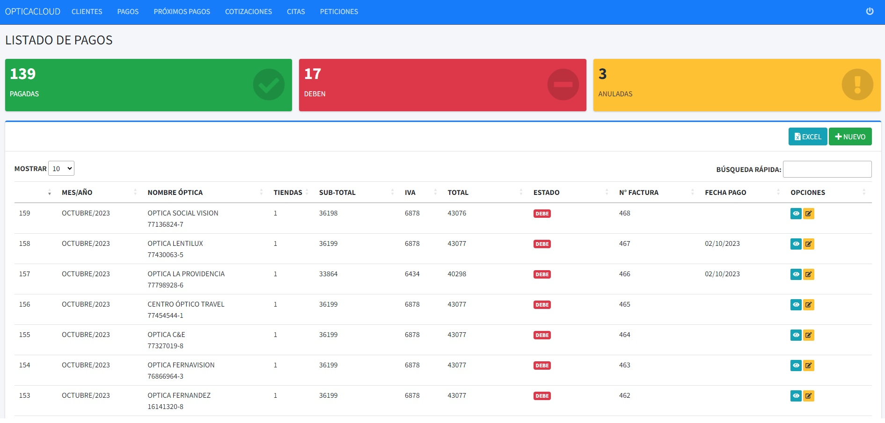

# Panel de Control de Pagos

## Vista Previa



## Descripción General

Este sistema permite el control de los pagos de clientes (Ópticas). Su Frontend fue creado mediante AdminLTE el cual usa los siguientes lenguajes: HTML5, CSS, Javascript. Su backend esta basado en Python y para ello se utilizó el framework de Django.

## Dev

Para el funcionamiento de este sistema en tu equipo, previamente debes tener instalado en tu equipo Python y Django. 

1. Clonar el proyecto.
2. Instalar las librerias que aparecen en requirements.txt. 
3. Ejecutar ```python manage.py runserver``` en la terminal.


